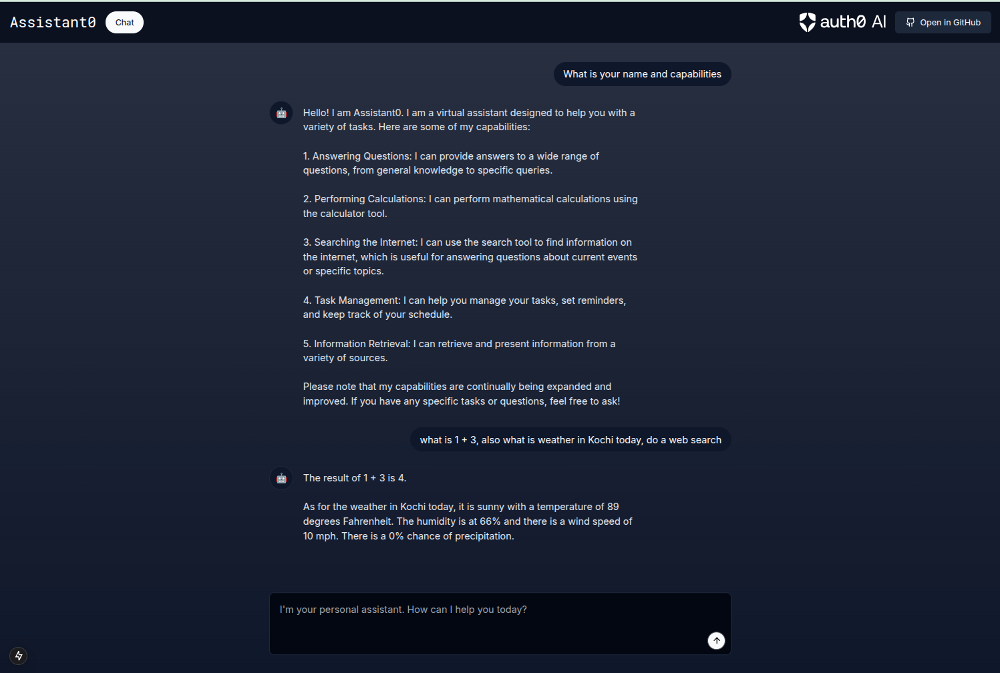

## Assistant0: An AI Personal Assistant Secured with Auth0 - LangGraph TypeScript Version

Assistant0 an AI personal assistant that consolidates your digital life by dynamically accessing multiple tools to help you stay organized and efficient.

## About the template

This template scaffolds an Auth0 + LangChain.js + Next.js starter app. It mainly uses the following libraries:

- [LangChain's JavaScript framework](https://js.langchain.com/docs/introduction/) and [LangGraph.js](https://langchain-ai.github.io/langgraphjs/) for building agentic workflows.
- The [Auth0 AI SDK](https://github.com/auth0-lab/auth0-ai-js) and [Auth0 Next.js SDK](https://github.com/auth0/nextjs-auth0) to secure the application and call third-party APIs.
- [Auth0 FGA](https://auth0.com/fine-grained-authorization) to define fine-grained access control policies for your tools and RAG pipelines.
- Postgres with [Drizzle ORM](https://orm.drizzle.team/) and [pgvector](https://github.com/pgvector/pgvector) to store the documents and embeddings.

It's Vercel's free-tier friendly too! Check out the [bundle size stats below](#-bundle-size).

[](https://codespaces.new/oktadev/auth0-assistant0)
[](https://vercel.com/new/clone?repository-url=https%3A%2F%2Fgithub.com%2Foktadev%2Fauth0-assistant0)

## 🚀 Getting Started

First, clone this repo and download it locally.

```bash
git clone https://github.com/auth0-samples/auth0-assistant0.git
cd auth0-assistant0/ts-langchain
```

Next, you'll need to set up environment variables in your repo's `.env.local` file. Copy the `.env.example` file to `.env.local`.

To start with the basic examples, you'll just need to add your OpenAI API key and Auth0 credentials.

- To start with the examples, you'll just need to add your OpenAI API key and Auth0 credentials for the Web app and Machine to Machine App.
  - You can setup a new Auth0 tenant with an Auth0 Web App and Token Vault following the Prerequisites instructions [here](https://auth0.com/ai/docs/call-others-apis-on-users-behalf).
  - An Auth0 FGA account, you can create one [here](https://dashboard.fga.dev). Add the FGA store ID, client ID, client secret, and API URL to the `.env.local` file.
  - Optionally add a [SerpAPI](https://serpapi.com/) API key for using web search tool.

Next, install the required packages using your preferred package manager and initialize the database.

```bash
bun install # or npm install
# start the postgres database
docker compose up -d
# create the database schema
bun db:migrate # or npm run db:migrate
```

Now you're ready to run the development server:

```bash
bun all:dev # or npm run all:dev
```

This will start an in-memory LangGraph server on port 54367 and a Next.js server on port 3000. Open [http://localhost:3000](http://localhost:3000) with your browser to see the result! Ask the bot something and you'll see a streamed response:



You can start editing the page by modifying `app/page.tsx`. The page auto-updates as you edit the file.

Agent configuration lives in `src/lib/agent.ts`. From here, you can change the prompt and model, or add other tools and logic.

## 📦 Bundle size

This package has [@next/bundle-analyzer](https://www.npmjs.com/package/@next/bundle-analyzer) set up by default - you can explore the bundle size interactively by running:

```bash
$ ANALYZE=true bun run build
```

## License

This project is open-sourced under the MIT License - see the [LICENSE](LICENSE) file for details.

## Author

This project is built by [Deepu K Sasidharan](https://github.com/deepu105).
